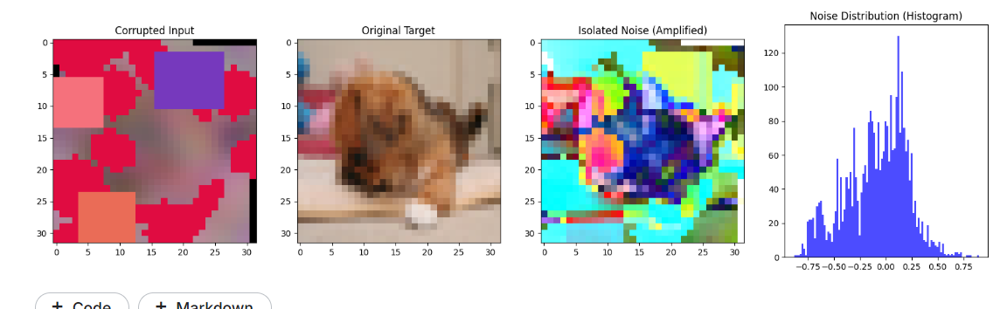
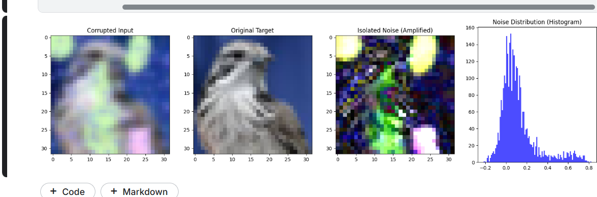
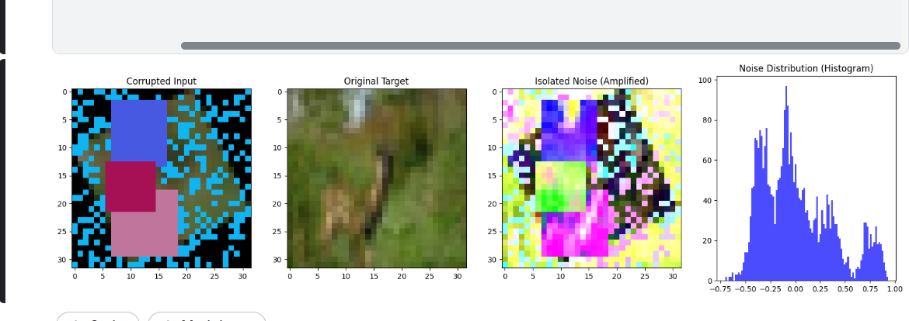
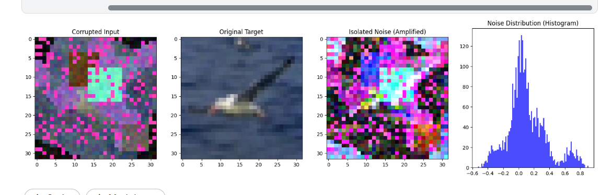
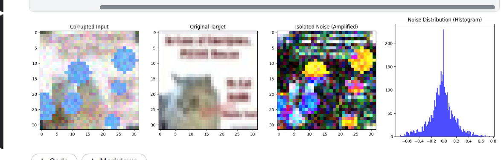
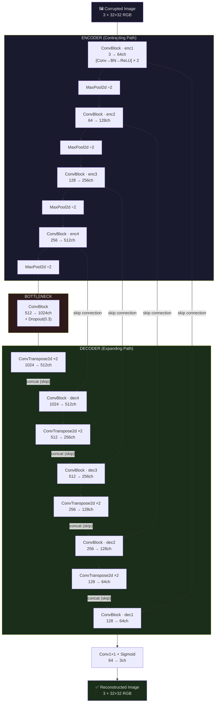

# Image Reconstruction Under Corruption — Kaggle Competition

🔗 **Competition:** [Kaggle — Image Reconstruction Under Corruption](https://www.kaggle.com/competitions/image-reconstruction-under-corruption)
🔗 **Dataset:** [Data Page](https://www.kaggle.com/competitions/image-reconstruction-under-corruption/data)

---

## Dataset

| File / Folder | Description |
|---|---|
| `train_corrupt/` | Corrupted training images (PNG, 32×32 RGB) |
| `train_clean/` | Corresponding clean training images |
| `train.csv` | Training metadata — columns: `id`, `class`, `clean_filename`, `corrupt_filename` |
| `test_corrupt/` | Corrupted test images (PNG, 32×32 RGB) |
| `sample_submission.csv` | Sample submission file with correct format |

**Image Details:** 32×32 pixels · 3 channels (RGB) · pixel values ∈ [0, 255] · 3,072 total pixels per image · ~108,002 files · 379.84 MB total

---

## Corruption Diagnosis

Noise residuals were isolated by computing `residual = corrupt − clean` (normalized to [−1, 1]). Five representative samples reveal a **mixture of distinct corruption types** applied in random composition per image:

| Sample | Visual Corruption | Noise Distribution Shape | Distribution Type | Implication |
|--------|------------------|--------------------------|-------------------|-------------|
| **1** (cat) | Scattered blue circular blobs + pixel scatter | Sharp Laplacian peak at 0, thin tails (range ±0.6) | **Laplacian / Sparse** | Blob masking with low-level pixel noise; well-concentrated errors |
| **2** (seabird) | Magenta salt-and-pepper + solid cyan block | Bimodal with heavy tails spanning ±0.8 | **Bimodal / Heavy-tailed** | Salt-and-pepper mixed with hard block replacement |
| **3** (deer) | Large solid-color rectangular blocks + black scatter | Multimodal, very wide spread (range ±0.75–1.0) | **Multimodal / Near-Uniform** | Large-region masking dominates; worst-case MSE scenario |
| **4** (hawk) | Blur + yellow/green soft blobs | Near-Gaussian centered at 0, mild right skew (range ±0.8) | **Near-Gaussian** | Blur-dominant; mildest structural corruption, recoverable via SSIM |
| **5** (dog) | Red/pink channel flooding + colored rectangular blocks | Bimodal/flat, wide tails (±0.75) | **Bimodal / Channel-selective** | Per-channel intensity shift + block masking; global color drift |

### Key Findings

- **No single corruption type** — each image receives a random composition of degradations at varying severities
- **Blur** (sample 4) → near-Gaussian residuals → recoverable with structure-aware losses (SSIM)
- **Block/masking** (samples 1–3) → heavy-tailed / multimodal residuals → requires MSE to aggressively penalize large pixel deviations
- **Channel-selective flooding** (sample 5) → global color drift → requires L1 to anchor the overall intensity space
- This composite finding directly drove the **tri-fold hybrid loss design**: `0.6×SSIM + 0.3×L1 + 0.1×MSE`

---

## Architecture: Lightweight U-Net (Baseline → AttentionUNet v3)

---

## Why U-Net Won Over NAFNet (SOTA)

| Model | Params | Resolution | Result |
|-------|--------|-----------|--------|
| **NAFNet** (SOTA) | 715K | 32×32 | MSE ~1000+ ❌ |
| **U-Net (ours)** | ~31M | 128×128 | MSE ~995 ✅ |

**Root Cause:** NAFNet is a data-hungry, compute-light architecture designed for megapixel images with millions of training samples. On a 16K-image dataset of 32×32 patches, its Transformer-style non-linear activations had nothing to generalize from. The U-Net's 40× more learning capacity — combined with its inductive bias from skip connections — proved far more suited to the low-data regime.

---

## Experimentation Journey

### Phase 1 — Diagnosis
- Computed noise residual: `residual = corrupt - clean`
- Found a **mixed corruption regime**: blur, salt-and-pepper, block masking, channel flooding — all randomly composed per image (see Corruption Diagnosis above)

### Phase 2 — Baseline UNet (V1)
- Simple UNet, `base=64`, ~31M params
- Loss: 80% MSE + 20% L1
- Score: **~998 MSE**

### Phase 3 — V2 (From-Scratch Upgrades)
- **Global Residual Learning:** network predicts the *corruption delta*, not the full clean image → mathematically easier target
- **Charbonnier Loss** (from NAFNet): smoothed L1 that penalizes errors without inducing blur
- **Checkpoint Ensembling + 4-Way TTA**
- Score: **995.62 MSE**

### Phase 4 — V3 (EfficientNet-B4 Backbone)
- Discovered HuggingFace pretrained weights were legal under competition rules
- Hybrid UNet with EfficientNet-B4 encoder via `segmentation_models_pytorch`
- Transfer learning: skipped ~20 epochs of low-level feature learning via ImageNet weights

### Phase 5 — V4 (Transformer Encoder — MiT-B4)
- Replaced CNN encoder with Mix Vision Transformer for global self-attention
- Hypothesis: Transformers can reference clean texture patches across the full image to reconstruct corrupted regions
- **Problem:** Transformers are data-hungry. 16K images is severely insufficient — model failed to converge meaningfully

### Phase 6 — Speed Optimization (I/O Bottleneck)
- Epoch time: **35 min** (GPUs sitting idle — disk I/O bound)
- Fix: **In-Memory Dataset** caching images as `uint8` arrays → 3.2 GB RAM (vs 12.7 GB for float32)
- Result: batch size ↑ 256, LR ↑ 3e-4, `torch.compile(mode='default')` enabled
- Epoch time: 35 min → **~5 min** · full training in **5–6 hours**

---

## Key Mathematical Decisions

- **SSIM window**: reduced 11 → 7 (window=11 on 128×128 = ~10% of image height, over-smooths fine textures)
- **ASPP dilations**: shrunk [1,3,5] → [1,2,3] (dilation=5 on an 8×8 feature map samples outside bounds into zero-padding)
- **Hybrid loss**: `0.6×SSIM + 0.3×L1 + 0.1×MSE` — SSIM restores high-freq structure, MSE aggressively punishes block artifacts, L1 anchors global color space

---

## Stack

`PyTorch` · `torch.compile` · `segmentation_models_pytorch` · `Kaggle Dual T4` · `HuggingFace`
